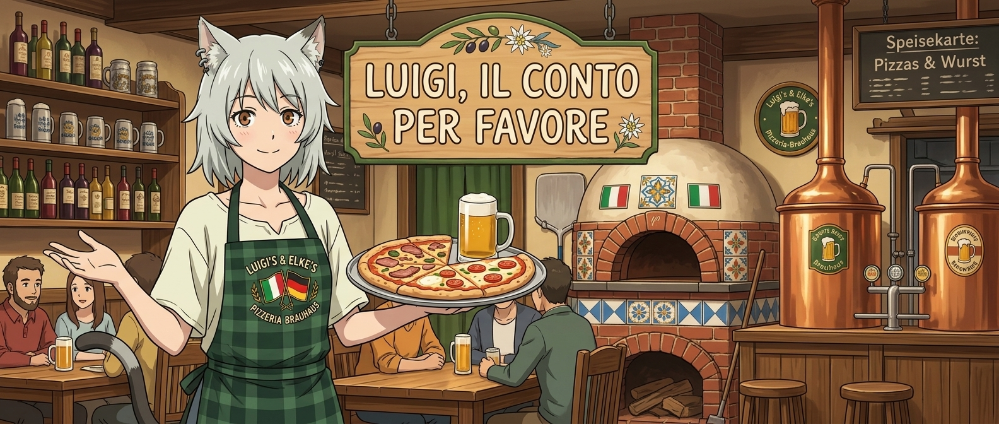

# Proyecto-Pizzeria.

  

Sistema web integral para la gestión de pedidos, productos, clientes y administración de ventas en una pizzería, desarrollado con **.NET**, **Razor Pages** y **MySQL**. Incluye una API REST documentada con **Swagger** para integración con clientes externos o servicios de terceros.

**Gestión de menú**

**Toma de pedidos**

# Tecnología usada 

**Lenguaje** C#

**Framework Backend** .NET 8.0 

**Frontend** Razor Pages

**Base de datos** MySQL

**Documentación API** Open API / Swagger UI 

**ORM / Conectividad** Entity Framework Core / Dapper / MySqlConnector

# Requisitos Previos

Antes de ejcutar nuestro programa debera contar con: 

* [.NET SDK 8.0](https://dotnet.microsoft.com/download) o superior.
* Servidor [MySQL](https://dev.mysql.com/downloads/installer/) ejecutándose localmente o en un contenedor.
* [Git](https://git-scm.com/) para el control de versiones.

# Instalacion 

**1. Clonar el repositorio**

**2. Configurar la Base de Datos**

**3. Aplicar las migraciones o scripts SQL**

**4. Ejecutar el proyecto**

